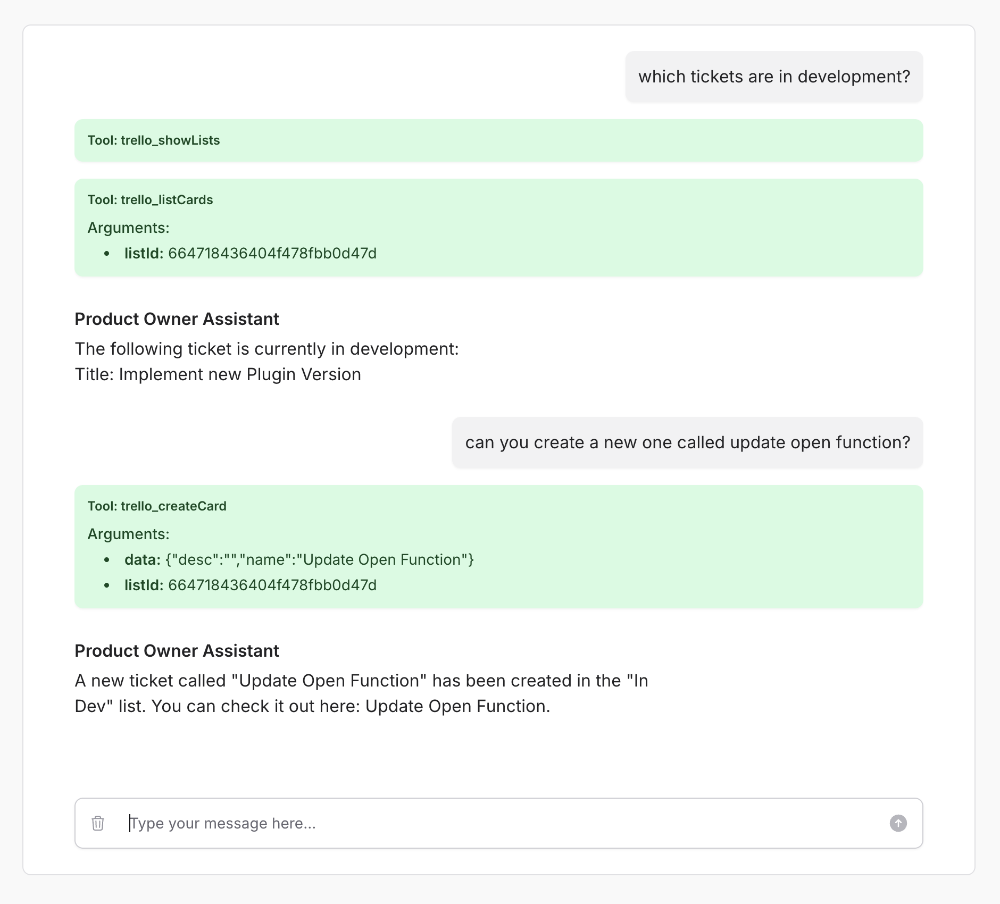

# Trello Open Function

The Trello Open Function is an implementation of the [Open Functions architecture](https://github.com/AssistantEngine/open-functions-core) designed to seamlessly connect to Trello. It enables language models (LLMs) to interact with Trello—listing board lists, retrieving card details, moving cards between lists, updating card information, and creating new cards—through a simple and structured interface.

## Installation

To install the Trello Open Function, simply use Composer:

```bash
composer require assistant-engine/open-functions-trello
```

## Usage

### Using the OpenAI PHP SDK

Below is a basic example of how to use the Trello Open Function directly with the OpenAI PHP SDK:

```php
<?php

use AssistantEngine\OpenFunctions\Trello\TrelloOpenFunction;
use AssistantEngine\OpenFunctions\Trello\Models\Parameters;
use OpenAI;

// Set up parameters for Trello authentication
$parameters = new Parameters();
$parameters->token = env('TRELLO_API_KEY');      // Your Trello API key
$parameters->tokenSecret = env('TRELLO_TOKEN');    // Your Trello token
$parameters->boardId = env('TRELLO_BOARD_ID');     // The ID of the Trello board

// Initialize the Trello Open Function
$trelloFunction = new TrelloOpenFunction($parameters);

// Generate function definitions (for tool integration with an LLM)
$functionDefinitions = $trelloFunction->generateFunctionDefinitions();

$client = OpenAI::client(env('OPENAI_TOKEN'));

$result = $client->chat()->create([
    'model'   => 'gpt-4o',
    'messages'=> [],
    'tools'   => $functionDefinitions
]);

$choice = $result->choices[0];

if ($choice->finishReason === 'tool_calls') {
    $toolCalls = processToolCalls($choice->message->toolCalls, $trelloFunction);
} 

function processToolCalls($toolCalls, $trelloFunction)
{
    $result = [];

    foreach ($toolCalls as $toolCall) {
        // Extract the function name (already namespaced) and arguments
        $functionName = $toolCall->function->name;
        $functionArgs = json_decode($toolCall->function->arguments, true);

        $response = $trelloFunction->callMethod($functionName, $functionArgs);
        $result[] = $response;
    }

    return $result;
}
```

### Using the Filament Assistant Plugin

The Trello Open Function can also be integrated as a tool within the [Filament Assistant Plugin](https://github.com/AssistantEngine/filament-assistant). To add it, include the following configuration in your `config/filament-assistant.php` file:

```php
// inside config/filament-assistant.php

// Tools configuration: each tool is identified by a key.
'tools' => [
    'trello' => [
        'namespace'   => 'trello',
        'description' => 'This tool allows you to manage your Trello boards, lists, and cards.',
        'tool'        => function () {
            $parameter = new \AssistantEngine\OpenFunctions\Trello\Models\Parameters();
            $parameter->token = env('TRELLO_API_KEY');
            $parameter->tokenSecret = env('TRELLO_TOKEN');
            $parameter->boardId = env('TRELLO_BOARD_ID');

            return new \AssistantEngine\OpenFunctions\Trello\TrelloOpenFunction($parameter);
        },
    ]
]
```

With this configuration in place, your assistant can directly utilize the Trello tool to manage board lists and cards.



## Methods

| **Method**      | **Description**                                                                                   | **Parameters**                                                                                                                                                                           |
|-----------------|---------------------------------------------------------------------------------------------------|-----------------------------------------------------------------------------------------------------------------------------------------------------------------------------------------|
| **showLists**   | List all lists on a specified Trello board.                                                     | *None (boardId is configured via parameters)*                                                                                                                                         |
| **listCards**   | List all cards in the specified list on the Trello board.                                       | **listId**: *string* (required)                                                                                                                                                         |
| **moveCard**    | Move a specified card to a new list.                                                            | **cardId**: *string* (required); <br> **listId**: *string* (required)                                                                                                                   |
| **getCard**     | Retrieve details of a specified card on the Trello board.                                       | **cardId**: *string* (required)                                                                                                                                                         |
| **updateCard**  | Update data of a card on the Trello board.                                                      | **cardId**: *string* (required); <br> **data**: *object* (required, must include: <br> • **name**: *string* <br> • **desc**: *string*)                                               |
| **createCard**  | Create a new card in a specified list.                                                          | **listId**: *string* (required); <br> **data**: *object* (required, must include: <br> • **name**: *string* <br> • **desc**: *string*)                                               |

## More Projects

We’ve created more repositories to simplify AI integration and enhance tool calling with large language models:

- **[Open Functions Core](https://github.com/AssistantEngine/open-functions-core)**: Provides a standardized way to implement and invoke functions for tool calling with LLMs.

> We are a young startup aiming to make it easy for developers to add AI to their applications. We welcome feedback, questions, comments, and contributions. Feel free to contact us at [contact@assistant-engine.com](mailto:contact@assistant-engine.com).

## Consultancy & Support

Do you need assistance integrating Open Functions into your application or help setting it up?  
We offer consultancy services to help you get the most out of our package, whether you’re just getting started or optimizing an existing setup.

Reach out to us at [contact@assistant-engine.com](mailto:contact@assistant-engine.com).

## Contributing

We welcome contributions from the community! Feel free to submit pull requests, open issues, and help us improve the package.

## License

This project is licensed under the MIT License. Please see [License File](LICENSE.md) for more information.
